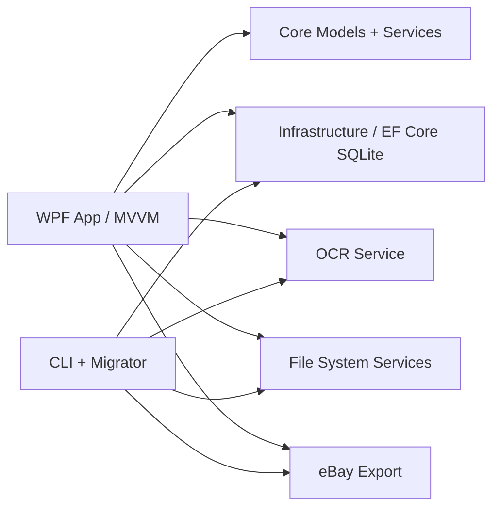

# Architecture

Boundaries:

- `Core`: domain models, enums, service contracts, pure domain helpers.
- `Infrastructure`: SQLite DbContext, EF migrations, JSON migration, database maintenance.
- `FileSystem`: scanning, hashing, file operation planning.
- `Ocr`: Tesseract invocation and adaptive learning.
- `Export`: copy-only eBay export.
- `App`: WPF views and MVVM composition.

